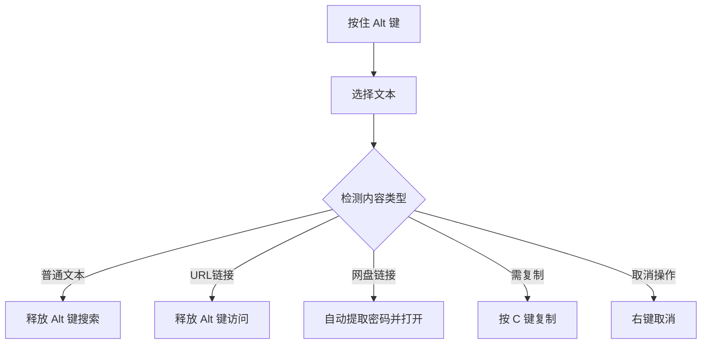

# SurperAlt
这是一个脚本，参考了https://github.com/52fisher/panAI
的2.1.9版本

可使用篡改猴，脚本猫等拓展进行安装

## 💽 安装地址

- **[安装地址（源地址）](https://raw.githubusercontent.com/boxniao/SurperAlt/refs/heads/main/SurperAlt.user.js)**
- **[安装地址（ghproxy镜像地址）](https://ghproxy.net/https://raw.githubusercontent.com/boxniao/SurperAlt/refs/heads/main/SurperAlt.user.js)**

# 🔍 Alt+文本选择增强插件

<div align="center">


**一款强大的浏览器文本选择增强工具，通过Alt键实现智能搜索、链接访问、网盘识别与自动填充**

[✨ 功能特性](#-功能特性) • [🚀 快速开始](#-快速开始) • [🎯 使用指南](#-使用指南) • [💾 配置说明](#-配置说明) • [🔧 技术细节](#-技术细节)

</div>

## ✨ 功能特性

### 🎨 核心亮点
- **一键智能操作**：按住Alt键选择文本，释放即执行智能操作
- **网盘专家**：自动识别12种主流网盘链接并智能填写提取码
- **无缝体验**：非侵入式设计，不干扰正常浏览
- **视觉反馈**：实时状态指示器和操作反馈

### 📊 功能概览

| 功能模块 | 功能描述 | 状态指示 |
|---------|---------|----------|
| 🔍 **智能搜索** | 选中文本后在新标签页搜索 | 🟢 → 🔍 |
| 🔗 **链接访问** | 自动识别并访问URL链接 | 🔗 |
| 📁 **网盘识别** | 智能识别12种网盘链接 | 📁 |
| 🗝️ **密码提取** | 从文本中自动提取提取码 | 🔑 |
| 📋 **快速复制** | Alt+选择+C键快速复制 | ✓ |
| ❌ **操作取消** | 右键点击取消当前操作 | ✕ |

## 🚀 快速开始

### 安装要求
- **浏览器扩展**：Tampermonkey 或 Greasemonkey
- **浏览器版本**：Chrome 80+ / Firefox 78+ / Edge 80+
- **系统要求**：Windows 10+ / macOS 10.14+ / Linux

### 安装步骤
1. **安装用户脚本管理器**
   ```bash
   # Chrome/Edge: 安装 Tampermonkey
   https://chrome.google.com/webstore/detail/tampermonkey/dhdgffkkebhmkfjojejmpbldmpobfkfo

   # Firefox: 安装 Greasemonkey
   https://addons.mozilla.org/firefox/addon/greasemonkey/
   ```

2. **安装本脚本**
   - 点击仓库中的 `alt-text-selection.user.js` 文件
   - Tampermonkey 会自动检测并显示安装界面
   - 点击"安装"按钮完成安装

3. **验证安装**
   - 刷新任意网页
   - 按住 Alt 键并选择文本，右上角应出现状态指示器

## 🎯 使用指南

### 基本操作流程


### 📝 详细操作说明

#### 1. **智能搜索**
```markdown
1. 按住 `Alt` 键不松开
2. 用鼠标选择想要搜索的文本
3. 释放 `Alt` 键
4. 系统会在新标签页中使用 Bing 搜索选中内容
```

#### 2. **链接访问**
```markdown
🔗 支持的链接格式：
- 完整URL：https://example.com
- 简化URL：www.example.com
- IP地址：192.168.1.1:8080
- 本地主机：localhost:3000
```

#### 3. **网盘智能处理**
| 操作场景 | 系统行为 | 提示信息 |
|---------|---------|----------|
| 选择含提取码的链接 | 自动提取密码并打开 | "检测到百度网盘链接，提取码：xxxx" |
| 选择无提取码链接 | 直接打开链接 | "检测到阿里云盘链接，正在打开..." |
| 访问网盘页面 | 自动填写提取码 | "AI已识别到密码！正自动帮您填写" |

#### 4. **快捷键操作**
| 快捷键 | 功能 | 状态指示 |
|--------|------|----------|
| `Alt + 选择` | 激活选择模式 | 🟢 |
| `Alt + 选择 + C` | 复制选中文本 | ✓ |
| `Alt + 选择 + 右键` | 取消当前操作 | ✕ |

## 📁 网盘支持列表

### 🌟 全面兼容12种主流网盘

| 网盘名称 | 识别域名 | 自动填充 | 密码存储 | 特殊功能 |
|---------|---------|----------|----------|----------|
| **百度网盘** | `pan.baidu.com`<br>`e.yun.baidu.com` | ✅ | Hash存储 | 链接自动补全 |
| **阿里云盘** | `aliyundrive.com`<br>`alipan.com` | ✅ | Hash存储 | 企业版支持 |
| **微云** | `share.weiyun.com` | ✅ | Hash存储 | 多密码框支持 |
| **蓝奏云** | `lanzou*.com` | ✅ | Hash存储 | 多域名支持 |
| **天翼云盘** | `cloud.189.cn` | ✅ | 自适应存储 | 移动端优化 |
| **迅雷云盘** | `pan.xunlei.com` | ✅ | Hash存储 | 复杂密码识别 |
| **123云盘** | `123pan.com` | ✅ | Hash存储 | 多子域名 |
| **夸克网盘** | `pan.quark.cn` | ✅ | Local存储 | 短链接识别 |
| **奶牛快传** | `cowtransfer.com` | ✅ | Hash存储 | 国际版支持 |
| **城通网盘** | `ctfile.com` | ✅ | Hash存储 | 镜像站支持 |
| **FlowUs息流** | `flowus.cn` | ✅ | Hash存储 | UUID识别 |

### 🔑 密码识别能力
- **多种密码格式识别**：
  ```regex
  提取码：abcd1234
  密码：wss:AbCdEfGh
  访问码：123456
  ?p=password123
  #key123456
  ```

- **智能提取策略**：
  1. 优先从URL参数提取
  2. 从选中文本正则匹配
  3. 从超链接文本提取（需开启设置）
  4. 从本地存储获取

## 💾 配置说明

### ⚙️ 默认配置
```javascript
// 默认开启的配置项
{
  "setting_active_in_front": true,    // 新标签页在前台打开
  "setting_text_as_password": false,  // 超链接文本作为密码
  "setting_auto_complete": false,     // 自动补全网盘链接
  "setting_auto_click_btn": true      // 自动点击提交按钮
}
```

### 🔧 配置修改方法
1. **通过Tampermonkey面板修改**
   - 点击浏览器扩展图标
   - 选择"管理面板"
   - 找到本脚本并点击"编辑"
   - 修改 `GM_setValue` 默认值

2. **运行时动态配置**
   ```javascript
   // 在控制台执行以下命令修改配置
   GM_setValue('setting_text_as_password', true);  // 开启超链接文本作为密码
   ```

## 🔧 技术细节

### 🏗️ 系统架构
```
📦 Alt+文本选择增强插件
├── 🎮 事件监听层
│   ├── 键盘事件处理 (Alt键检测)
│   ├── 鼠标事件处理 (选择/右键)
│   └── 选择变化监听
├── 🔍 智能识别层
│   ├── 文本解析引擎
│   ├── 网盘识别器
│   ├── 密码提取器
│   └── 链接验证器
├── 🚀 执行引擎
│   ├── 搜索执行模块
│   ├── 链接访问模块
│   ├── 网盘处理模块
│   └── 剪贴板操作
└── 🎨 UI反馈层
    ├── 状态指示器
    ├── 通知系统
    └── 选择样式管理
```

### 🛡️ 安全机制
- **本地化处理**：所有操作在浏览器本地完成
- **权限最小化**：仅请求必要的 `GM_*` API权限
- **输入验证**：严格验证所有用户输入和URL
- **沙箱隔离**：通过用户脚本沙箱环境运行

### 📈 性能优化
- **懒加载机制**：仅在需要时加载处理模块
- **事件防抖**：避免频繁触发选择事件
- **缓存策略**：智能缓存网盘配置
- **异步处理**：非阻塞式UI更新

## 📋 常见问题

### ❓ 常见问题解答

| 问题 | 解决方案 |
|------|----------|
| Alt键与其他软件冲突 | 可在脚本中修改触发键（需修改源代码） |
| 网盘链接无法识别 | 检查链接格式，或提交issue反馈 |
| 密码自动填充失败 | 确认已开启自动点击按钮设置 |
| 移动端支持不佳 | 移动端建议使用桌面模式浏览 |

### 🐛 故障排除
```bash
# 1. 检查脚本是否运行
按住Alt键，查看右上角是否出现指示器

# 2. 检查控制台错误
打开开发者工具 (F12) → Console标签页

# 3. 验证脚本权限
Tampermonkey面板 → 检查脚本是否启用

# 4. 清除缓存刷新
Ctrl + F5 强制刷新页面
```

## 📄 更新日志

### v3.6 (当前版本)
- ✅ **新增**：FlowUs息流网盘支持
- ✅ **优化**：网盘识别算法准确率提升
- ✅ **修复**：移动端兼容性问题
- ✅ **改进**：密码提取逻辑更智能

### v3.5
- ✅ **新增**：夸克网盘、奶牛快传支持
- ✅ **优化**：UI反馈系统视觉效果
- ✅ **增强**：链接验证安全性
- ✅ **改进**：选择性能优化

### v3.0
- 🎉 **重构**：全新架构设计
- ✅ **新增**：多网盘同时支持
- ✅ **优化**：内存占用减少30%
- ✅ **增强**：错误处理机制

## 🤝 贡献指南

### 开发环境搭建
```bash
# 1. 克隆仓库
git clone https://github.com/your-repo/alt-text-selection.git

# 2. 安装依赖（如果需要）
npm install

# 3. 导入到Tampermonkey
# 将 .user.js 文件拖入Tampermonkey管理面板
```

### 代码贡献
1. **Fork 仓库**
2. **创建特性分支**：`git checkout -b feature/AmazingFeature`
3. **提交更改**：`git commit -m 'Add some AmazingFeature'`
4. **推送分支**：`git push origin feature/AmazingFeature`
5. **创建 Pull Request**

```


